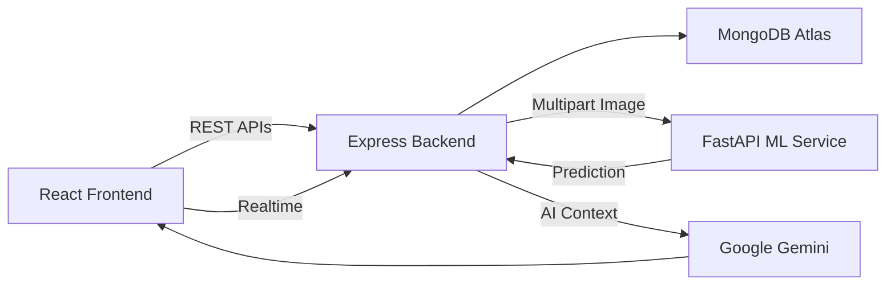
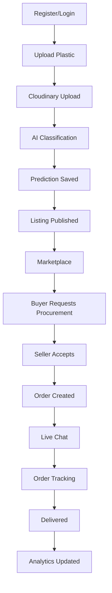

<div align="center">

# ♻️ ReplastAI

### AI-Powered Plastic Circular Economy Platform

**An intelligent marketplace that leverages Artificial Intelligence and Computer Vision to streamline plastic waste collection, classification, procurement, and recycling—enabling a smarter circular economy.**

<br>


</div>

---

# 📖 Overview

ReplastAI is an end-to-end AI-powered platform designed to bridge the gap between plastic contributors and recyclers. The system combines a digital marketplace, computer vision, procurement management, real-time communication, and sustainability analytics into one unified platform.

---

# ✨ Features

| Module | Description |
|---------|-------------|
| 🔐 Authentication | Secure JWT authentication with role-based authorization |
| ♻ Marketplace | Plastic listing, search, filters, image upload and management |
| 🤖 AI Classification | Automatic plastic type prediction using a pretrained Computer Vision model |
| 📦 Procurement | Buyer–seller workflow with live order tracking |
| 💬 Chat | Real-time communication using Socket.IO |
| 🔔 Notifications | Order updates, procurement requests and chat notifications |
| 📊 Dashboard | Revenue, plastic traded, CO₂ saved and analytics |
| 🧠 AI Assistant | Google Gemini powered recycling assistant |

---

# 🏛 System Architecture



---

# 🔄 Complete Workflow



---

# 🛠 Tech Stack

| Layer | Technology |
|--------|------------|
| Frontend | React + TypeScript + Vite |
| Backend | Node.js + Express |
| Database | MongoDB Atlas |
| Authentication | JWT |
| AI Service | FastAPI + Transformers |
| Computer Vision | PyTorch + OpenCV + Pillow |
| AI Assistant | Google Gemini |
| Image Storage | Cloudinary |
| Realtime | Socket.IO |

---

# 📂 Project Structure

```text
ReplastAI
│
├── src/                  React Frontend
├── server/               Express Backend
├── ml-service/           FastAPI ML Service
├── public/
├── package.json
├── server.ts
├── tsconfig.json
└── README.md
```

---

# ⚙ Installation

```bash
git clone https://github.com/your-username/ReplastAI.git

cd ReplastAI

npm install

npm run dev
```

---

## ML Service

```bash
cd ml-service

pip install -r requirements.txt

uvicorn main:app --reload
```

---

# 🔑 Environment Variables

Create a `.env` file.

```env
MONGO_URI=

JWT_SECRET=

GEMINI_API_KEY=

CLOUDINARY_CLOUD_NAME=

CLOUDINARY_API_KEY=

CLOUDINARY_API_SECRET=

ML_SERVICE_URL=http://localhost:8000
```

---

# 📊 Sustainability Metrics

ReplastAI estimates environmental impact using the approximation:

> **1 kg of recycled plastic ≈ 1.5 kg of CO₂ emissions avoided**

This value is used for dashboard analytics and sustainability reporting.

---

# 🚀 Future Enhancements

- Fine-tuned Plastic Classification Model
- IoT Smart Bin Integration
- Blockchain Traceability
- Mobile Application
- Carbon Credit Marketplace

---

<div align="center">

### 👨‍💻 Developed by

**Amrutha Kattimani**

**ReplastAI — AI-Powered Plastic Circular Economy Platform**

⭐ If you found this project useful, consider giving it a star!

</div>