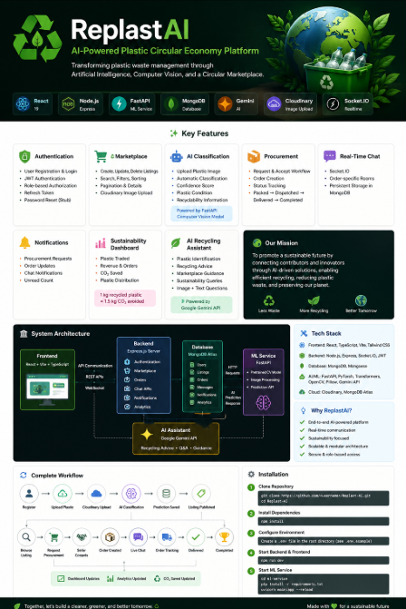

# ♻️ ReplastAI

### AI-Powered Plastic Circular Economy Platform

A full-stack AI-powered platform that connects plastic contributors and recyclers through an intelligent marketplace, enabling efficient plastic trading, automated material classification using Computer Vision, real-time procurement workflows, sustainability analytics, and an AI recycling assistant to support a circular economy.

---

## 🏗️ System Architecture

  

---

## 🚀 Overview

ReplastAI is designed to simplify and modernize plastic waste management by integrating Artificial Intelligence with a digital marketplace. The platform enables contributors to list recyclable plastic materials, automatically classifies uploaded plastics using a pretrained Computer Vision model, connects buyers and sellers through a procurement workflow, supports real-time communication, and provides sustainability insights such as CO₂ savings and recycling analytics.

### Core Modules

- 🔐 Secure Authentication & Role-Based Access
- ♻️ Plastic Marketplace
- 🤖 AI Plastic Classification
- 📦 Procurement & Order Tracking
- 💬 Real-Time Chat
- 🔔 Notifications
- 📊 Sustainability Dashboard
- 🧠 AI Recycling Assistant